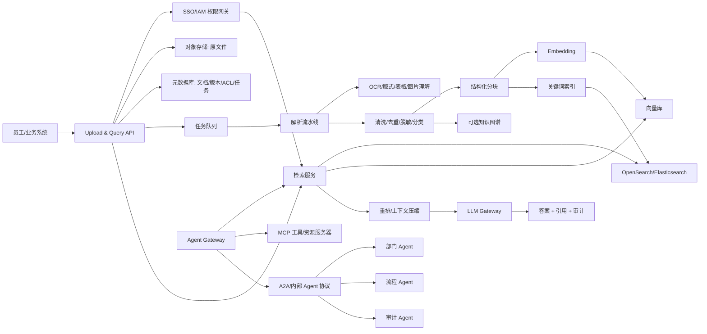
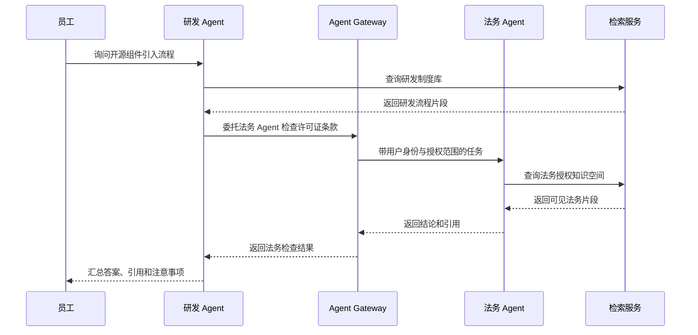
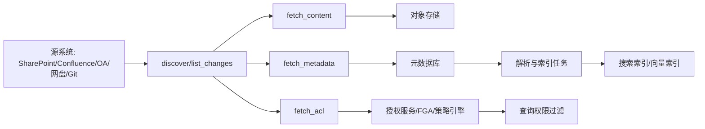

# 企业知识库参考架构

调研日期：2026-05-29

## 1. 目标能力

目标系统应具备以下能力：

- 统一文档入口：员工、部门系统、批处理任务都通过标准接口接入文档。
- 异步处理：上传后不阻塞用户，后台完成解析、清洗、索引和评估。
- 多租户隔离：按部门、项目、密级、角色和授权空间隔离。
- 混合检索：关键词、向量、元数据过滤、重排结合。
- 可引用问答：答案必须带来源片段、文档版本、权限上下文。
- 多 Agent 协作：不同 Agent 可通信，但通过网关鉴权和审计。
- 治理闭环：可观测、可评估、可回滚、可删除、可重建索引。

## 2. 总体架构



## 3. 文档上传接口设计

上传接口不应只收文件本身，还要接收最小治理元数据。

建议 API：

- `POST /documents/uploads`：创建上传任务，返回 upload_url 或 multipart session。
- `POST /documents/{document_id}/commit`：提交上传完成，进入解析队列。
- `GET /documents/{document_id}/status`：查询解析、索引、失败原因。
- `POST /query`：知识库问答或检索。
- `POST /agents/{agent_id}/tasks`：向某个 Agent 发起受控任务。

上传请求建议字段：

```json
{
  "filename": "研发规范.docx",
  "source": "manual_upload",
  "department_id": "rd",
  "space_id": "rd-platform",
  "project_id": "optional-project",
  "classification": "internal",
  "acl_policy": {
    "mode": "department_only",
    "allowed_users": [],
    "allowed_roles": ["rd-engineer"]
  },
  "tags": ["规范", "研发流程"],
  "language": "zh-CN"
}
```

关键原则：

- 原文件先落对象存储，不直接写入数据库。
- 元数据与文件内容分离，便于权限、审计、重建索引。
- 上传后异步处理，接口只返回任务 ID。
- 所有文档都必须有 owner、department_id、space_id、classification。
- 文档版本必须显式记录，避免旧版本制度污染答案。

## 4. 文档处理流水线

推荐流水线：

1. 接收文件：校验大小、MIME、扩展名、病毒扫描、hash 去重。
2. 原件归档：保存到对象存储，记录 checksum、版本和上传者。
3. 格式识别：PDF、DOCX、PPTX、XLSX、图片、HTML、Markdown、TXT。
4. 内容解析：提取正文、标题层级、表格、图片说明、页码、段落位置。
5. OCR：扫描件和图片型 PDF 进入 OCR。
6. 清洗标准化：转成 Markdown/JSON，保留章节、页码、表格、图片引用。
7. 分类打标：自动识别部门、文档类型、主题、密级、有效期。
8. DLP 检测：识别手机号、身份证、客户信息、财务敏感字段等。
9. 分块：按标题、段落、表格、页码、语义边界进行结构化分块。
10. 索引：写入向量库、关键词搜索库和元数据库。
11. 评估：抽样检查解析质量和检索命中质量。
12. 发布：文档状态从 `processing` 变成 `ready`。

解析工具建议：

- Docling：适合 PDF、Office 文档转结构化内容，保留版式信息。
- MinerU：适合复杂 PDF、论文、扫描件、版面解析和 OCR 场景。
- Unstructured：适合企业 ETL，覆盖多格式文档解析和 chunking。
- Apache Tika：适合做通用格式识别和基础文本抽取兜底。
- MarkItDown：适合轻量地把 Office/PDF/HTML 等转成 Markdown。

## 5. 检索与问答链路

推荐查询流程：

1. 用户请求进入 Query API。
2. SSO/IAM 解析用户身份、部门、角色、项目授权。
3. 构造权限过滤条件：department_id、space_id、classification、acl_policy。
4. 查询改写：补全同义词、缩写、部门术语。
5. 混合召回：BM25 + 向量检索 + 元数据过滤。
6. 重排：使用 reranker 对候选片段排序。
7. 上下文压缩：去重、合并同章节片段、限制 token。
8. 生成答案：LLM 只基于可见片段回答。
9. 引用返回：返回文档名、版本、页码、段落、链接。
10. 审计记录：记录用户、问题、命中文档、最终引用、模型、耗时。

强制要求：

- 权限过滤必须发生在召回阶段之前或召回阶段内部。
- 答案必须显示引用，无法引用时明确提示“不确定”。
- 不同部门知识库默认不可互查，除非存在明确授权。
- 高密级文档需要额外审批或只允许摘要级访问。

## 6. 部门隔离模型

推荐采用多层隔离，而不是单点隔离。

### 数据模型

每个文档、分块、索引项都至少带以下字段：

- `tenant_id`：企业或集团租户。
- `department_id`：部门。
- `space_id`：知识空间，如“HR 制度库”“研发平台文档库”。
- `project_id`：项目级隔离，可为空。
- `classification`：public、internal、confidential、restricted。
- `acl_policy_id`：权限策略 ID。
- `owner_user_id`：负责人。
- `source_system`：来源系统。
- `document_version`：版本。
- `effective_date` / `expire_date`：生效和失效时间。

### 向量库隔离策略

可选方案：

- 逻辑隔离：同一 collection/index，用 metadata filter 按部门和空间过滤。成本低、易运维，适合大多数部门。
- 物理隔离：不同部门或高密级空间使用独立 collection/index。隔离强，成本和运维复杂度更高。
- 混合隔离：普通部门逻辑隔离，法务、财务、战略、人事高密空间物理隔离。

推荐：混合隔离。

原因：

- 普通知识库用逻辑隔离能减少索引碎片。
- 高敏部门独立 collection/index 能降低误配置影响。
- 企业上线后可以按部门密级渐进拆分，不需要一开始过度设计。

## 7. 多 Agent 协作架构

Agent 不应直接共享数据库账号或向量库账号。建议引入 Agent Gateway。

组件：

- Department Agent：部门专属，如 HR Agent、Legal Agent、R&D Agent。
- Workflow Agent：流程型，如入职、合同审核、故障排查、销售支持。
- Knowledge Maintenance Agent：负责文档分类、摘要、过期提醒、质量检查。
- Audit Agent：检查越权风险、低置信答案、敏感内容泄露。
- Agent Gateway：统一鉴权、路由、限流、审计、协议转换。
- MCP Server：把企业工具、知识查询、工单、日历、CRM 等作为受控工具暴露。
- A2A/Internal Protocol：承载 Agent 间任务委托、状态回执和结果引用。

通信原则：

- Agent 之间传任务，不传无限制上下文。
- 每次 Agent 调用都携带调用者身份、原始用户身份、授权范围。
- 被调用 Agent 只返回授权范围内的答案或结构化结果。
- 跨部门请求默认需要策略允许，必要时触发人工审批。
- Agent 输出必须带来源引用和责任边界。

示例：



## 8. 安全治理

必须设计的安全能力：

- 身份：SSO/OIDC/SAML/LDAP，服务账号单独管理。
- 权限：RBAC + ABAC，部门、角色、项目、密级组合判断。
- DLP：上传和回答都做敏感信息检查。
- Prompt injection 防护：把文档内容视为不可信输入，不执行文档中的指令。
- 数据投毒防护：新文档进入审核或低信任区，重要知识需人工确认。
- 审计：上传、解析、查询、命中、回答、Agent 调用全链路记录。
- 删除：支持文档删除、版本失效、索引删除、缓存失效。
- 加密：对象存储、数据库、向量库、搜索库静态加密，传输 TLS。
- 隔离：高密部门独立 collection/index，必要时独立模型或私有部署。

参考安全资料：

- OWASP Top 10 for LLM Applications: https://owasp.org/www-project-top-10-for-large-language-model-applications/
- NIST AI Risk Management Framework: https://www.nist.gov/itl/ai-risk-management-framework

## 9. 可观测与评估

建议从第一天就建立评估闭环：

- 解析质量：是否漏页、表格是否乱、OCR 是否准确、章节结构是否保留。
- 检索质量：Recall@K、MRR、命中文档是否正确。
- 生成质量：faithfulness、answer relevance、context precision。
- 权限测试：用户不能命中未授权文档。
- 延迟与成本：上传处理耗时、查询 P95、embedding 成本、LLM 成本。
- 用户反馈：答案有用/无用、引用错误、需要人工补充。

可参考工具：

- Ragas: https://github.com/explodinggradients/ragas
- TruLens: https://github.com/truera/trulens
- Arize Phoenix: https://github.com/Arize-ai/phoenix
- LangSmith: https://docs.smith.langchain.com/

## 10. 最小可行系统边界

第一版不建议做太多能力。MVP 应包含：

- 上传 API。
- PDF/DOCX/PPTX 解析。
- 异步任务状态。
- 部门级权限隔离。
- 混合检索和引用问答。
- 管理后台或管理 API：查看文档、重建索引、删除文档。
- 审计日志。
- 基础评估集。

第一版可以暂缓：

- 完整知识图谱。
- 复杂跨部门 Agent 网络。
- 自动审批流。
- 全量企业系统连接器。
- 细粒度到段落级动态授权。

## 11. 源系统连接器架构

企业知识库不能只依赖人工上传。正式平台应把每个源系统连接器抽象成统一协议。



连接器统一能力：

- `discover`：发现站点、空间、文件夹、知识库。
- `list_changes`：按 checkpoint 增量列出新增、更新、删除、移动、改名。
- `fetch_content`：获取原文文件或正文。
- `fetch_metadata`：获取标题、路径、作者、更新时间、版本、标签。
- `fetch_acl`：获取用户、组、继承权限、外链分享、临时授权。
- `ack_checkpoint`：确认同步位点。

同步优先级：

1. 删除和撤权事件。
2. ACL 变更。
3. 文档内容更新。
4. 元数据和标签更新。

原因：删除和撤权影响安全边界，必须优先于内容新鲜度。

## 12. 撤权、删除与缓存失效

必须设计以下链路：

- 文档删除：源系统删除后，本平台标记 `deleted`，搜索索引和向量索引删除对应 chunk。
- 文档撤权：ACL 变更后，授权服务更新权限版本，查询缓存按权限版本失效。
- 文档改密级：classification 提升后，旧索引项立即不可被低权限用户检索。
- 用户离职：身份系统禁用用户后，所有会话和 Agent 委托 token 失效。
- 版本失效：旧版本从默认索引移除，只能在历史归档中被授权查询。

建议记录审计事件：

```json
{
  "event_type": "acl_changed",
  "document_id": "doc-123",
  "old_acl_version": 17,
  "new_acl_version": 18,
  "source_system": "sharepoint",
  "changed_at": "2026-05-29T18:30:00+08:00",
  "index_invalidation": "completed"
}
```

## 13. 审计可还原设计

企业安全审计通常不仅问“现在有没有权限”，还会问“当时为什么能看到”。建议审计日志保存：

- 用户身份：user_id、department_id、roles、groups。
- 请求信息：query、query_time、request_id、source_ip、client_app。
- 权限快照：acl_version、allowed_scopes、classification_ceiling。
- 检索结果：候选文档 ID、最终引用 chunk ID、过滤掉的原因统计。
- 模型信息：模型、prompt 模板版本、参数、token 用量。
- Agent 链路：caller_agent、target_agent、delegation_reason、tool_calls。
- 输出：答案 hash、引用列表、人工反馈。

审计日志中是否保存完整问题和答案，需要按企业合规要求决定。如果问题本身可能包含敏感信息，至少应支持脱敏存储和受控查询。

## 14. 推荐服务边界

为了避免后期系统变成一个巨大后端，建议按以下服务边界拆分：

| 服务 | 职责 |
| --- | --- |
| Upload API | 上传、分片、原文件入库、任务创建 |
| Connector Service | 源系统同步、ACL 同步、checkpoint |
| Document Processing Service | 解析、OCR、清洗、分块、分类、DLP |
| Metadata Service | 文档、版本、空间、标签、生命周期 |
| Authorization Service | RBAC/ABAC/ReBAC、权限快照、策略决策 |
| Indexing Service | embedding、关键词索引、向量索引、删除重建 |
| Retrieval Service | 权限过滤、混合检索、重排、上下文组装 |
| LLM Gateway | 模型路由、限流、成本、审计、降级 |
| Agent Gateway | Agent 注册、通信、工具调用、跨部门授权 |
| Audit/Eval Service | 审计、trace、评估集、质量报表 |

MVP 可以把这些服务合并部署，但代码边界建议提前分清。
